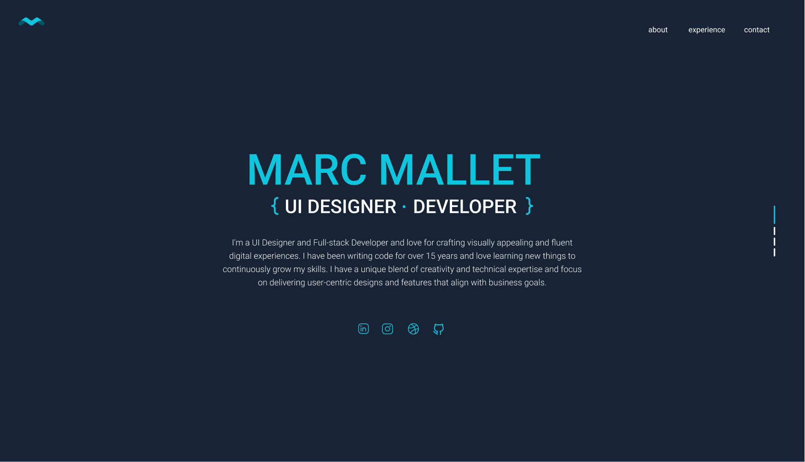

<div align="center" style="padding-top: 10px; padding-bottom: 10px">
  <h1 align="center" style="margin: 0; padding: 0; text-transform: uppercase; color: #0EC5DE">Marc Mallet</h1>
  <h4 align="center" style="margin: 0; padding: 0; font-weight: 200; text-transform: uppercase">
    UI Designer <span style="color: #0EC5DE">•</span> Developer
  </h4> 
  <br>
  <a href="https://marcmallet.com" target="_blank" style="color: #0EC5DE">Live Website</a>
  &nbsp;|&nbsp;
  <a href="https://dribbble.com/marcmallet" target="_blank" style="color: #0EC5DE">Dribbble Profile</a>
</div>

<hr/>



<div align="center" style="padding-top: 10px; padding-bottom: 20px">
  This is my personal website and the main purpose for this is act portfolio extension of my LinkedIn profile. 
  The website is built with <a href="https://www.react.dev" target="_blank" style="color: #0EC5DE">React</a> 
  and hosted on <a href="https://www.render.com/" target="_blank" style="color: #0EC5DE">Render.com</a>. In addition;
  <a href="https://vitejs.dev" target="_blank" style="color: #0EC5DE">Vite</a> was used as the build tool for this project, because it focuses on providing fast, lean, and efficient 
  bundling and hot module replacement (HMR) capabilities. This make the development experience much faster.
</div>

<hr/>

### 🛠 Getting it up and running
1. Install all the dependencies
    ```sh
    npm install
    ```
2. Run the application for development
    ```sh
    npm run dev
    ```
3. Build the application
    ```sh
    npm run build
    ```
4. Preview built application (The get an idea of what `prd` would be like)
    ```sh
    npm run preview
    ```

